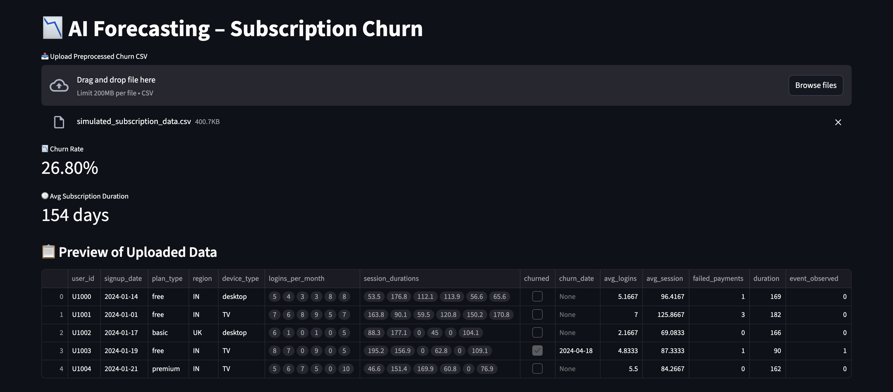

# AI_Forecasting_SubscriptionChurn

This Streamlit app predicts **if and when a user will churn** from a subscription-based service (like Netflix, Spotify, or SaaS apps). It combines **time series insights** and **survival analysis** to help businesses **retain customers** more effectively.

 

---

## 📊 Features

- 📁 Upload user engagement + payment history data
- 📉 View churn rate and average subscription duration
- 🔁 Predict **time-to-churn** using the Cox Proportional Hazards model
- 📈 Visualize survival curves for top users
- 🧼 Clean and responsive UI built with Streamlit

---

## 🛠 Built With

- `Python`
- `Streamlit`
- `Pandas`
- `Lifelines` (survival analysis)
- `Matplotlib`

---

## 🚀 Live Demo

👉 [Try the App Now](https://ai-churn-dashboard.streamlit.app/)  
_No login required. Runs completely in your browser._

---

## 📂 Sample Dataset Format

Upload a preprocessed CSV file with the following structure:

```csv
user_id, signup_date, churned, churn_date, logins_per_month, session_durations, payments, duration, event_observed
1, 2023-01-01, TRUE, 2024-02-10, "[3, 4, 5]", "[100.5, 98.2, 87.0]", "[9.99, 9.99, 9.99]", 120, 1
...
